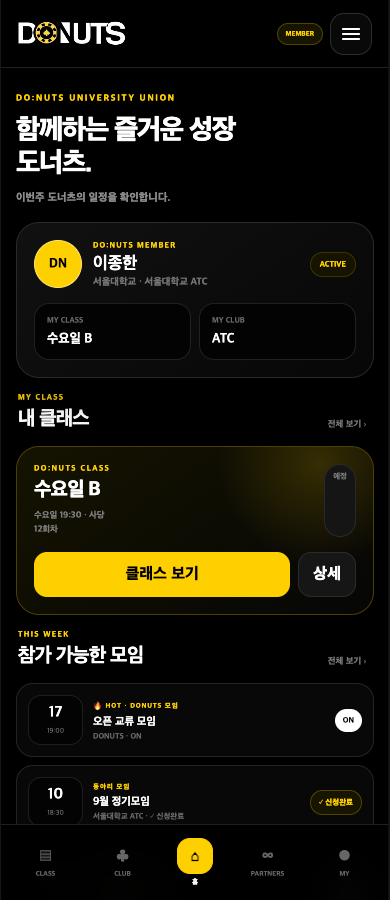
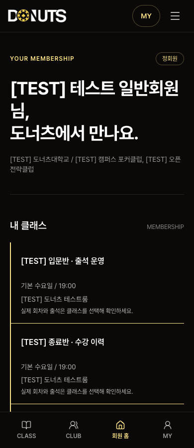
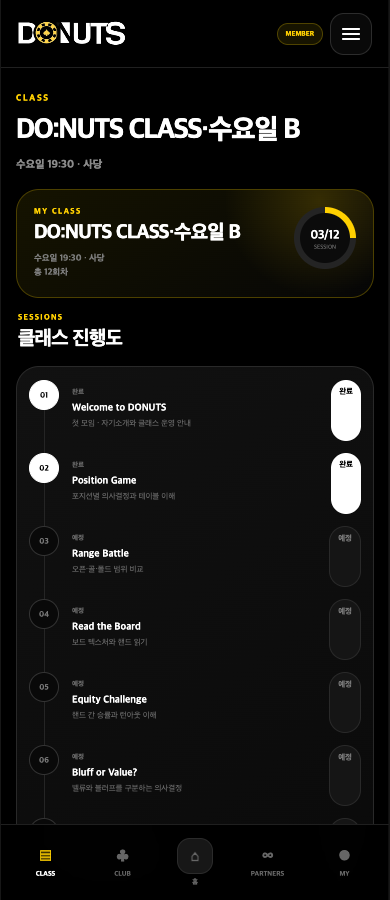
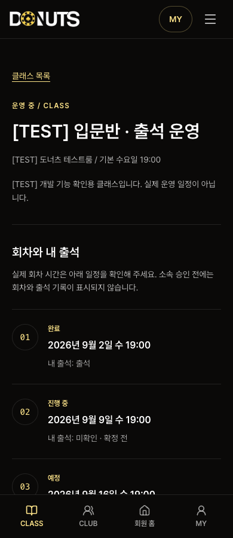
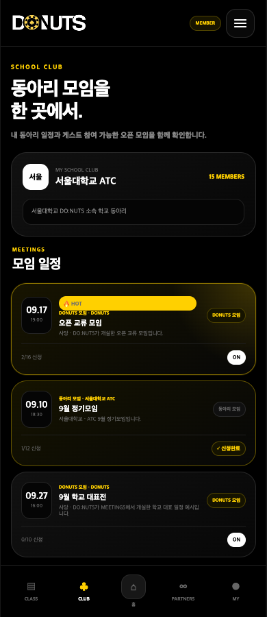
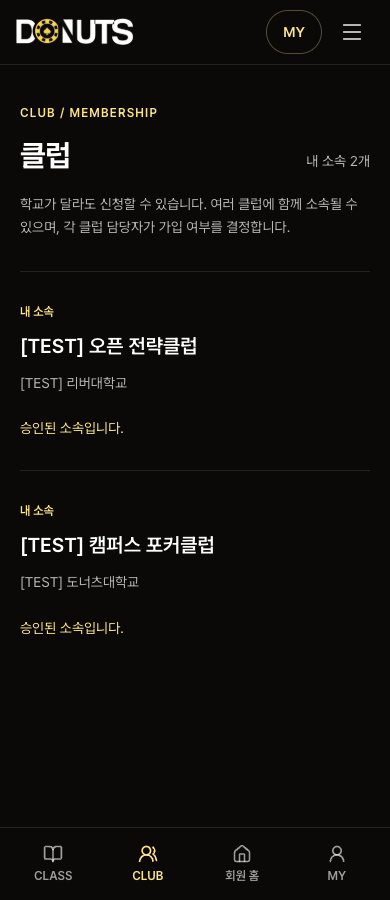
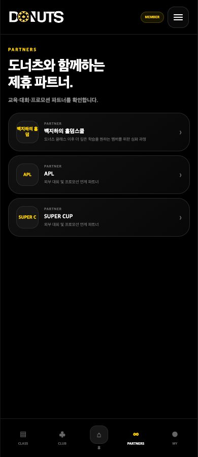

# 배포 화면과 원본 예시 비교 — 2026-09-15

현재 배포본은 원본의 화면 구성과 이용 흐름을 상당 부분 축약한 상태다. 회원·소속·출석·모임·학습의 운영 기능은 구현되어 있지만, 홈에서 보여주던 핵심 정보가 흩어져 있고, 파트너와 회차별 교육 내용 등은 화면뿐 아니라 데이터 모델부터 빠져 있다.

최신 Production 배포는 로컬 소스와 같은 `01f47ab67231965f133970248fbe840969109731`이다. 아래 차이들은 단순히 최신 화면 코드가 배포되지 않아 생긴 것으로 보기 어렵다.

**비교 기준과 확인 범위**

- 운영 사이트: <https://donutskr.vercel.app>. 일반 회원·클래스장·클럽장 기존 테스트 계정으로 로그인해 확인했다.
- 원본 화면: [제공된 HTML 프로토타입](../handoff/donuts-class-developer-handoff-v1/prototype/index.html).
- 원본 요구사항: [PRD](../handoff/donuts-class-developer-handoff-v1/docs/01_PRODUCT_REQUIREMENTS.md), [화면 흐름](../handoff/donuts-class-developer-handoff-v1/docs/04_UI_FLOWS.md), [XP·학습](../handoff/donuts-class-developer-handoff-v1/docs/05_XP_DAILY_LEARNING.md), [QA 목록](../handoff/donuts-class-developer-handoff-v1/docs/08_QA_ACCEPTANCE_CHECKLIST.md).
- 이후 확정된 [정책 변경](../MEMBER_CLASS_CLUB_DECISIONS.md), [이메일 로그인](../EMAIL_ONLY_AUTH.md), [도메인 확장 기록](../DOMAIN_EXTENSIONS.md), [일정·시리즈 삭제](../SCHEDULE_SERIES_REMOVAL.md)를 우선 적용했다.
- 회원 화면은 모바일 390px, 홈은 태블릿 768px·데스크톱 1440px도 확인했다. 관리자 영역은 현재 배포 커밋의 소스·서버 액션·마이그레이션을 검사했다. 관리자 실계정으로 운영 화면을 조작한 검증은 아니다.
- 원본과 운영의 예시 계정·이름·소속 수는 다르다. 이 데이터 차이 자체는 누락으로 계산하지 않았다. 운영에 표시된 `[TEST]` 데이터는 기존 검증용 데이터다.
- 신청·취소·승인·출석 변경·학습 제출을 새로 실행하지 않았다. 이번 분석에서 운영 코드나 업무 데이터를 변경하지 않았다.

**주요 차이**

| 영역 | 원본 예시·요구사항 | 현재 배포본 | 판단 |
| --- | --- | --- | --- |
| 회원 홈 | 브랜드 소개, 프로필 카드, MY CLASS·MY CLUB, 클래스 강조 카드, 참가 가능 모임, 파트너 | 인사말, 학교·클럽 텍스트, 내 클래스 목록 | 홈 구성 대폭 축약 |
| 하단 메뉴 | CLASS / CLUB / HOME / PARTNERS / MY | CLASS / CLUB / 회원 홈 / MY | PARTNERS 누락. 모임·학습은 상단 메뉴에만 존재 |
| CLASS | 내 클래스 진행도, 회차 제목·설명·상태, 회차 상세 | 소속 신청 목록 → 클래스 상세 → 날짜·출석 목록 | 진입 흐름 변경 + 교육 내용·상세 누락 |
| CLUB | 내 클럽 소개와 참가 가능한 모임을 한 화면에서 확인 | 클럽 소속 신청 목록. 모임은 `/meetings`로 분리 | 기존 기능의 이동 + 화면 간 연결 부족 |
| 모임 | HOT 우선, 주최, 신청자/정원, 나의 신청 상태 | HOT 배지와 날짜 정렬, 정원, 일반적인 신청 안내 | 정렬 및 목록 정보 누락 |
| PARTNERS | 회원 목록·홈 노출·관리자 편집·순서·로고·링크 | `/partners` 404, 전용 관리 화면·서비스·스키마 없음 | 도메인 전체 미구현 |
| 리더 | 로그인 후 관리/회원 모드 선택, 담당 영역과 대기 승인 통합 | 리더도 `/home`으로 이동. 운영·승인·모임이 별도 경로 | 운영 기능은 있으나 진입·대시보드 축약 |
| 관리자 회원 관리 | 상세 정보 수정, 소속 필터, 회원 삭제 | 이름·전화번호 검색, 상태 필터, 정지·복구·리더 해제 | 정보 수정·탈퇴 처리 등 미구현 |
| XP·학습 | 홈 진입 카드, MY 활동 기록, 학습 전용 흐름 | MY에 XP·통계, `/learn`에 5문항·채점·해설 | 기능은 존재. 홈 연결·학습 UX·통합 XP 내역 부족 |
| 신규 가입 | 가입 양식 제출 | 준비 중 안내만 표시 | 폼 코드 존재, 운영 설정 미완료 |

**1. 회원 홈 — 원본의 핵심 구성이 사라졌다**

원본 HTML의 `page-home`에는 소개 문구, DN 아바타를 포함한 회원 카드, 소속 요약, 내 클래스 카드, 참가 가능한 모임, 제휴 파트너가 있다. 현재 `/home`은 `YOUR MEMBERSHIP`, 이름을 크게 넣은 인사말, 학교·클럽 텍스트, 클래스 목록으로 끝난다.

빠진 것은 다음과 같다.

- 프로필 카드와 MY CLASS·MY CLUB 요약.
- 클래스의 전체 회차 수와 진행/예정 상태를 보여주는 강조 카드.
- 참가 가능한 모임과 HOT 모임 요약.
- 파트너 미리보기와 전체 보기.
- 확장 요구사항의 XP·연속 학습·오늘의 학습 진입 카드.

XP와 학습, 모임은 다른 페이지에 있으므로 이 세 도메인이 통째로 없다는 뜻은 아니다. 홈에서 해당 기능을 발견하고 바로 이용할 수 있는 구성이 빠진 것이다. 파트너는 연결할 기능 자체가 없다.

종료된 클래스도 현재 홈의 `내 클래스`에 같은 모양으로 표시된다. 실제 테스트 회원에서 종료반이 운영 중 클래스 사이에 나타났고 종료 배지는 없었다. 회원 소속 조회가 종료 상태를 가져오지 않아, 현재 활동과 과거 수강 이력을 구분하기 어렵다.

근거: [홈 구현](../../app/(member)/home/page.tsx), [소속 조회](../../lib/membership/server.ts), 원본 HTML 74–83행, UI 흐름 C, XP 문서의 Home·Suggested home priority.

| 원본 홈 — 모바일 첫 화면 | 현재 홈 — 모바일 첫 화면 |
| --- | --- |
|  |  |

**2. CLASS — 출석 운영은 있지만 무엇을 배우는지 보여주는 내용이 없다**

원본 CLASS는 내 수업의 진행도와 회차 타임라인이 중심이다. 각 회차에 `Welcome to DONUTS`, `Position Game` 같은 제목과 설명이 있고, 클릭하면 상세가 열린다.

현재 `/class`는 전체 클래스의 소속 신청 목록이다. 승인된 클래스를 선택하면 `/class/[id]`에서 회차 번호·날짜·상태·내 출석을 볼 수 있다. 실제 출석과 일정 데이터는 연결되어 있다.

그러나 회차별 제목·설명은 `ClassSession` 타입과 `class_sessions` 테이블에 필드가 없고, 운영자 편집 화면에도 입력란이 없다. 회원 회차 상세 링크도 없다. 화면에 숨겨진 정도가 아니라 **DB → 서버 → 운영자 편집 → 회원 표시 전체를 추가해야 하는 누락**이다.

완료/전체 회차와 현재 진행을 요약하는 표시도 없다. 원본의 연결된 타임라인은 날짜 중심 구분선 목록으로 바뀌었다. 복수 클래스 정책 때문에 클래스 선택은 필요해졌지만, 선택 후 수업 진행 화면을 축약해야 하는 이유는 되지 않는다.

클래스 생성 시 요일별 A/B 기본명을 자동 제안하는 기능, 리더 이름 검색도 빠져 있다. 현재는 클래스명을 직접 입력하고 리더 후보 전체 목록에서 선택한다.

근거: [회원 클래스 상세](../../app/(member)/class/[id]/page.tsx), [SessionList](../../components/classes/SessionList.tsx), [회차 모델](../../lib/classes/types.ts), [0026 스키마](../../supabase/migrations/0026_class_club_operations.sql), [클래스 편집](../../components/membership/EntityForms.tsx). 원본 PRD 6·10, UI 흐름 D, QA Classes.

| 원본 CLASS | 현재 승인된 클래스 상세 |
| --- | --- |
|  |  |

**3. CLUB — 모임 중심 화면이 소속 신청 목록으로 바뀌었다**

원본은 내 클럽의 로고·이름·소개·회원 수와 내 클럽/오픈 모임을 한 화면에 보여준다. 현재 `/club`은 클럽 목록과 소속 승인 상태, 신청 기능이다. `/club/[id]`도 학교·소개·신청 상태 링크만 있고 클럽의 모임 목록이 없다.

모임 서비스는 `/meetings`에 구현되어 있으나 클럽 상세에서 해당 클럽 모임으로 이어지는 연결이 없다. 원본 CLUB의 목적이었던 “내 클럽에서 언제 무엇을 하는가”를 현재 CLUB에서 해결하기 어렵다.

클럽 로고는 `logo_url` 저장 필드가 있지만 관리 화면은 URL 직접 입력만 제공한다. 회원 화면에 이미지가 렌더링되지 않고, 운영 화면에서도 등록 주소를 새 탭으로 여는 링크 수준이다. 원본의 파일 업로드·미리보기·회원 노출 흐름이 완성되지 않았다. 기존 푸터 스폰서의 업로드 기능은 재사용 가능한 자원이다.

근거: [클럽 상세](../../app/(member)/club/[id]/page.tsx), [소속 목록](../../components/membership/AffiliationCatalog.tsx), [클럽 편집](../../components/membership/EntityForms.tsx), [클럽 운영](../../components/clubs/ClubManagement.tsx), [기존 로고 업로드](../../components/admin/FooterSponsorsEditor.tsx). 원본 PRD 7·10, UI 흐름 F, QA Clubs.

| 원본 CLUB | 현재 CLUB |
| --- | --- |
|  |  |

**4. 모임 — 기능 이동 외에 실제로 빠진 동작이 있다**

| 항목 | 확인된 차이 | 필요한 범위 |
| --- | --- | --- |
| HOT 우선 정렬 | 실제 목록의 첫 모임은 일반 모임, 두 번째가 HOT였다. 서버 쿼리는 날짜·ID만 정렬한다. | 목록 쿼리와 표시 |
| 내 신청 상태 | 목록은 신청 완료·대기·자리 제안 여부 대신 `신청 가능 · 만석 시 대기` 같은 공통 문구를 보여준다. | 사용자별 상태 조회·목록 표시 |
| 신청자/정원 | 목록은 `6명`처럼 정원만 표시한다. 확정·예약·대기 수는 상세에 있다. | 목록 집계·표시 |
| 주최와 모임 종류 | 목록은 주최 클럽 이름 없이 `주최 클럽 소속`/`모든 정회원`으로 표현한다. | 목록 주최 정보 |
| DONUTS 주최 | 원본은 관리자 개설 시 DONUTS 주최. 현재 관리자도 특정 클럽을 골라야 하며 `club_id`는 필수다. | 주최 데이터 모델·권한·운영 폼 |
| 신청·취소 확인 | 원본의 확인 팝업 없이 바로 서버 액션을 제출한다. | 확인 인터랙션 |
| 완료 안내 | 확인 체크박스는 있지만 “24시간 뒤 일반 목록에서 숨김, DB 기록 유지” 안내 중 24시간 설명이 없다. | 완료 시 안내 |

대기열·자리 제안·명시적 확정, 정원 처리, 완료 기록 보존을 새로 만들어야 한다는 의미는 아니다. 관련 화면과 서버 처리는 이미 있다. 이번 분석에서는 신청·취소를 실행하지 않았다.

근거: [현재 모임 목록](https://donutskr.vercel.app/meetings), [목록 컴포넌트](../../components/meetings/MeetingIndex.tsx), [서버 정렬](../../lib/meetings/server.ts), [상세 동작](../../components/meetings/MeetingDetail.tsx), [개설 폼](../../components/meetings/MeetingEditor.tsx), [0028 스키마](../../supabase/migrations/0028_club_meetings.sql). 원본 PRD 8, UI 흐름 F–H.

[실제 모임 목록 캡처](2026-09-15-reference-comparison/live-member-meetings.png)에서 일반 모임 다음에 HOT 모임이 표시되는 것을 확인할 수 있다.

**5. PARTNERS — 전체 기능이 빠져 있다**

원본의 파트너는 회원이 이름·설명·로고를 보고 외부 URL로 이동하고, 관리자는 등록·수정·삭제·노출 순서를 관리하는 독립 영역이다.

운영 `/partners`는 404다. 배포 소스와 마이그레이션에서도 파트너 전용 페이지·관리자 화면·서비스·데이터 모델을 찾을 수 없다. 홈 미리보기와 하단 PARTNERS 메뉴도 함께 없다.

현재 남아 있는 `site_config.footer_sponsors`는 공개 랜딩 푸터의 이름·로고·URL 설정이다. 설명과 회원용 목록, 전용 관리 흐름을 갖춘 원본 파트너 기능을 대신하지 않는다. 구현 시 기존 업로드·설정 구조를 활용할 수는 있지만, 어느 저장 모델을 쓸지부터 정해야 한다.

근거: [현재 PARTNERS 경로](https://donutskr.vercel.app/partners), [푸터 설정 타입](../../lib/site/types.ts), [관리자 메뉴](../../components/admin/AdminNav.tsx). 원본 PRD 9, UI 흐름 I.

| 원본 PARTNERS | 현재 같은 경로 |
| --- | --- |
|  |  |

**6. 로그인·리더 운영 — 권한과 화면 모드가 구분되지 않는다**

원본은 리더에게 로그인 후 클래스장 관리뷰·동아리장 관리뷰·회원뷰 중 허용된 모드를 선택하게 한다. 관리뷰에는 담당 클래스/클럽, 회차나 직접 개설한 모임, 승인 대기가 함께 있다.

실제 클래스장과 클럽장 로그인 모두 `/home`으로 이동했다. 현재는 홈의 운영 링크를 통해 `/leader/class`, `/leader/club`, `/leader/approvals`로 이동하고, 모임 운영은 `/leader/meetings`에 따로 있다. 담당 엔티티와 출석·승인 기능은 존재하지만 관리 홈과 모드 선택이 없다. 관리 페이지에도 일반 회원 하단 메뉴가 그대로 나타난다.

리더의 서버 권한 검사가 없다는 의미는 아니다. 필요한 것은 기존 권한을 사용한 역할별 진입점·현재 모드 표시·관련 업무 연결이다. 원본처럼 관리/회원 모드를 나누더라도 모드 선택을 권한으로 사용하면 안 된다.

근거: [로그인 분기](../../app/auth/actions.ts), [홈 운영 링크](../../app/(member)/home/page.tsx), [회원 메뉴](../../components/membership/MemberNav.tsx), [엔티티 회원·리더 패널](../../components/membership/EntityPeoplePanel.tsx). 원본 UI 흐름 B·E, 프로토타입 리더 화면.

**7. 관리자 회원 관리 — 안내한 업무를 실제로 처리할 화면이 부족하다**

현재 회원 디렉터리는 이름·전화번호 검색, 회원 상태 필터, 정지·복구·리더 해제를 제공한다. 엔티티별 소속 해제와 리더 지정은 별도 클래스·클럽 관리 화면에 있다.

다음은 빠져 있다.

- 이름·전화번호·학교 등 회원 기본정보의 관리자 수정.
- 클래스·클럽·학교별 회원 필터와 이메일 기반 회원 찾기.
- 회원 상세에서 소속을 종합적으로 조회·관리하는 흐름.
- 관리자 지원용 비밀번호 재설정 흐름. 회원 본인의 비밀번호 복구와는 별개다.
- 확정 정책에 따른 탈퇴·개인정보 익명화 처리.

특히 MY는 “회원 정보 수정은 운영진에게 요청”하라고 안내하지만 관리자에게 해당 기본정보 수정 폼이 없다. 사용자 안내와 운영자 처리 기능이 이어지지 않는다.

원본의 “회원 삭제”를 단순 행 삭제로 복구하면 안 된다. 이후 정책은 로그인 차단, 소속 종료, 리더 권한 회수, 개인정보 익명화, 출석·XP·운영 이력 보존까지 요구한다. 이 부분은 서버·Auth·DB 처리가 필요하다. `DOMAIN_EXTENSIONS.md`도 광범위한 프로필 편집과 탈퇴/익명화를 미구현 범위로 명시한다.

관리자 메뉴도 원본 MEMBERS/CLASS/CLUB/MEETINGS/PARTNERS 5개 구조에서 확장 기능을 나열한 구조로 바뀌었다. 후속 클래스·학습·알림의 추가 자체를 누락으로 보지는 않지만, PARTNERS가 없고 첫 회원 화면이 전체 회원 목록 대신 승인 대기라는 차이가 있다.

근거: [회원 디렉터리](../../app/admin/(protected)/members/directory/page.tsx), [회원 서버 액션](../../app/admin/actions/members.ts), [MY 안내](../../app/(member)/my/page.tsx), [엔티티별 관리](../../components/membership/EntityPeoplePanel.tsx), [구현 범위 기록](../DOMAIN_EXTENSIONS.md). 원본 PRD 5, 이후 정책 Leaders, suspension and withdrawal.

**8. XP·학습 — 핵심 처리는 있으나 화면 연결과 일부 조회가 덜 완성됐다**

XP·학습은 원본 HTML에서 완성된 화면이 아니며 별도 문서의 `TO BUILD` 요구사항이다. 따라서 원본 화면 누락과 추가 요구사항의 잔여 구현을 구분해야 한다.

현재 MY에는 누적 XP·레벨·다음 레벨 진행도, 최근 출석, 완료 학습일·연속 학습·정답률·난이도별 통계·오답 복습이 있다. `/learn`에는 날짜별 공통 5문항, 단일/복수 정답, 서버 채점, 획득 XP, 해설과 GTO 검증 근거가 있다. 테스트 회원의 완료 결과와 오답 복습도 실제로 표시됐다.

남은 차이는 다음과 같다.

- 홈에서 오늘의 학습·XP·연속 학습으로 바로 이어지지 않는다. 주간 XP 요약도 없다. 주간 XP는 원본 문서상 권장 항목이다.
- 미완료 학습 UI는 5문항을 한 화면에서 제출하는 폼이다. 원본 확장 명세의 시작 화면, 문제별 진행도·다음 문제, 완료 후 streak·다음날 방문 안내가 없다. 피드백은 전체 제출 후 제공한다. 최종 완료를 5문항 서버 채점 후 확정하는 현재 정책은 유지해야 한다.
- 포커 상황을 위한 스택·포지션·핸드·보드·액션 이력의 독립 필드와 표시가 없다. 현재는 문제 본문과 GTO 가정 텍스트에 기록한다. 원본의 구조화된 스팟 요구를 충족하려면 작성 도구·모델·학습 표시를 함께 확장해야 한다.
- MY의 `XP 지급·조정 이력`은 클래스 XP만 조회한다. 총 XP는 모든 원장을 합산하지만 이력 쿼리가 `class_sessions`와 내부 조인하므로 `session_id = null`인 학습 XP가 빠진다. XP 지급 누락과는 다르며, 사용자에게 보여주는 통합 내역의 누락이다.
- 운영자 문항별 응시수·보기별 선택률 화면은 없다. 이 통계는 원본 문서에서 향후 운영 기능으로 제시한 항목이며, 이후 확정된 초기 개인 통계는 이미 구현되어 있다. 초기 필수 기능 전체가 누락됐다고 평가하면 부정확하다.

근거: [학습 화면](../../app/(member)/learn/page.tsx), [MY 학습](../../components/learning/MyLearning.tsx), [학습 모델](../../lib/learning/types.ts), [문항 작성](../../components/learning/QuestionComposer.tsx), [운영자 학습](../../app/admin/(protected)/learning/page.tsx), [XP 조회 611–632행](../../supabase/migrations/0026_class_club_operations.sql), [학습 XP 모델](../../supabase/migrations/0029_reviewed_daily_learning.sql).

실제 테스트 회원은 총 270 XP가 표시됐지만, [펼친 지급 내역](2026-09-15-reference-comparison/live-member-xp-ledger.png)에는 출석 +100 XP 두 건만 표시됐다. 학습으로 받은 나머지 70 XP의 이력이 목록에서 빠지는 사례다.

**9. 신규 가입 — 구현 누락이 아니라 현재 운영 설정으로 막혀 있다**

운영 `/signup`은 HTTP 200이지만 “가입 신청을 준비하고 있습니다”라는 안내만 표시한다. 공개 가입 설정을 읽어 확인한 값은 다음과 같다.

| 설정 | 확인 결과 |
| --- | --- |
| 가입 접수 `signup_open` | `false` |
| 동의 문서 버전 | 미설정 |
| 개인정보 수집·이용 안내 URL | 미설정 |

가입 폼과 서버 액션은 있다. 따라서 “회원가입 기능이 아예 없다”는 평가는 틀리지만, **현재 신규 사용자는 실제 가입을 시작할 수 없다**. 가입 운영을 시작하려면 안내 문서·동의 버전을 준비하고 기존 가입 설정을 완료해야 한다. 분석 과정에서 접수를 임의로 열지 않았다.

근거: [현재 가입 페이지](https://donutskr.vercel.app/signup), [가입 표시 조건](../../app/(auth)/signup/page.tsx), [가입 설정 화면](../../app/admin/(protected)/members/settings/page.tsx).

**10. 디자인·접근성 관찰**

원본과 현재 모두 어두운 배경과 노란 강조색을 쓰지만, 정보 위계가 다르다. 원본의 프로필 카드, 강조된 클래스 카드, 연결된 회차 타임라인, HOT 모임 강조가 현재는 넓은 여백과 구분선 목록으로 바뀌었다. 색상 조정만으로 원본의 경험을 회복할 수 있는 차이가 아니다.

모바일에서는 긴 인사말이 첫 화면의 많은 부분을 차지하며, 여러 소속과 종료 클래스까지 나열되면 다음 행동을 찾기 위해 더 내려가야 한다. 원본의 작은 배지·글자 크기 등을 그대로 복제하기보다 핵심 정보와 행동의 순서를 복원하는 것이 적절하다.

검사한 화면에서 가로 넘침은 발견하지 못했다. 11개 화면·뷰포트 조합에 실행한 자동 WCAG 검사에서는 MY의 `definition-list` 오류 1종이 발견됐다. `MyLearning`의 `<dl>` 안 `
`에 `
`가 `<dt>/<dd>`와 형제로 들어간 구조가 원인이다. 자동 검사 결과만으로 전체 접근성 준수를 보장하지는 않는다.

근거: [MY 학습 마크업](../../components/learning/MyLearning.tsx), 브라우저 캡처 및 axe 결과. 이번에는 모든 키보드·로딩·오류·쓰기 흐름을 수동 검증하지 않았다.

**원본과 달라도 누락으로 계산하지 않은 항목**

| 차이 | 판단 근거 |
| --- | --- |
| 기존 공개 일정·시리즈 메뉴와 DB 삭제 | 소유자가 명시적으로 요청한 제거. 복원 대상이 아니다. 현재 클럽 모임과 클래스 회차는 별도 도메인이다. |
| 아이디 대신 이메일 로그인 | 이후 확정된 이메일 전용 로그인 정책 |
| 이메일 인증 후 정회원, 소속별 별도 승인 | 이후 확정 정책. 원본의 전체 회원 승인 대기로 되돌릴 대상이 아니다. |
| 여러 클래스·클럽 소속, 타 학교 클럽 신청 | 이후 확정 정책 |
| 회차 수 12개 제한 없음, 실제 회차 날짜 저장 | 이후 확정 정책 |
| 만석 시 대기열·자리 제안·본인 확정 | 이후 확정 정책. 원본의 단순 신규 신청 거절보다 확장된 동작 |
| 종료·보관·후속 클래스와 운영 이력 보존 | 이후 확정 정책. 단순 초기화·영구 삭제로 되돌리면 안 된다. |
| 실제 Resend 이메일 발송 미설정 | 사용자에 의해 명시적으로 보류됨. 회원용 서비스 내 알림과 구분해야 한다. |
| 별도 공개 랜딩 `/` 유지 | 원본 회원 HOME의 대응 경로는 `/home`. 공개 랜딩은 별도 화면이다. |

**구현 범위에 따른 우선순위**

| 순서 | 묶음 | 필요한 작업 범위 |
| --- | --- | --- |
| 1 | 원본의 핵심 화면 복원 | 홈 프로필·클래스 진행·모임·학습 진입, CLUB의 모임 연결, 역할별 운영 진입, 회원 메뉴 정리 |
| 1 | 실제 기능 누락 보완 | 파트너 전체, 회차 제목·설명·상세, 관리자 회원 기본정보 수정·탈퇴/익명화 |
| 2 | 목록·조회 정확성 | HOT 우선 정렬, 내 모임 신청 상태·인원, 종료 클래스 구분, 학습 XP를 포함한 지급 내역 |
| 2 | 운영자 사용성 | 클럽 로고 업로드·노출, DONUTS 주최, 회원/리더 검색·필터, 신청·취소·완료 확인 |
| 3 | 확장 학습 UX | 문제 진행 흐름·완료 안내·구조화된 포커 상황. 권장·향후 통계는 초기 필수 범위와 구분 |
| 운영 준비 | 가입 접수 | 개인정보 안내·동의 버전·접수 설정을 완료해야 신규 가입 가능 |

화면 중심 작업은 이미 존재하는 회원·출석·모임·학습 서비스를 연결해 진행할 수 있다. 파트너·회차 콘텐츠·탈퇴 처리·DONUTS 주최는 스키마와 서버 동작까지 이어지는 별도 구현이 필요하다. 레거시 일정·시리즈를 되살릴 필요는 없다.

**검증 기록**

- Production 배포 ID: `6433337812`, 상태 `success`, SHA `01f47ab67231965f133970248fbe840969109731`.
- 배포 URL: <https://donutskr-6qs17is0a-donutskr.vercel.app>.
- 주요 브라우저 확인: 2026-09-15 19:32–19:40 KST. XP 내역은 이후 추가 확인.
- 근거 화면은 이 문서와 같은 이름의 디렉터리에 원본 PNG로 보관했다. 비교 이미지는 390×900 첫 화면이며, 페이지 전체 내용을 나타내는 이미지는 아니다.
- 브라우저 캡처·텍스트·자동 접근성 검사 원본: `/private/tmp/donuts-reference-audit/evidence/report.json`. 임시 파일이므로 주요 판단은 이 문서와 보관된 이미지에 기록했다.
